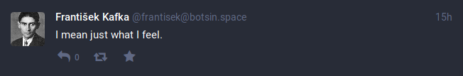

# František Kafka

František Kafka is a bot that generates text using Markov chains. It is online at [https://botsin.space/@frantisek](https://botsin.space/@frantisek) where it's creating an inifinite version of Franz Kafka's Metamorphosis.



## Installation

You need your input text in plain text; [Project Gutenberg](https://www.gutenberg.org) is a good source for that. Make sure to remove all parts of the text that are not to be used as the bot's corpus.<sup>1</sup>
You will also need an access token, so register your app at a mastodon instance of choice to get one. Copy the `.env.example` to `.env` and edit it to set up the environment correctly.
Building an running the Clojure code requires [leiningen](https://leiningen.org/) version 2.8 or above.

1: This means removing the copyright notice, which is the reason why there is no text included in this repository. 

## Usage

```
# build it and run it
$ lein uberjar
$ java -jar target/uberjar/heyarne.frantisek-kafka-0.1.0-standalone.jar [args]
```

## Options

```
$ lein run -- --help
František Kafka is a Markov chain bot that infinitely generates text
from one or more text files. botsin.space/@frantisek hosts a live
version of it that generates an infinite version of Franz Kafka's Metamorphosis.

Usage: frantisek [options] [corpus...]

Options:
  -o, --order ORDER        2      Order of the Markov chain. Defaults to 2.
  -i, --interval INTERVAL  21600  Interval between toots in seconds.
  -h, --help
```
